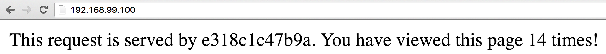

## Simple Node

This is a simple Node.js impage which uses redis as backend. It displays the hostname of the container which serves the request and how many times the page has been visited.



### Usage

1. You need to have redis running on port 6379 and discoverable as 'redis'. For example, you can start redis by

```
docker run -d -p 6379:6379 --name redis redis
```

2. Run this image

```
docker run -d -p 80:8080 --link redis:redis chenglong/simple-node
```

3. Test

```
curl <HOST_IP>
```
